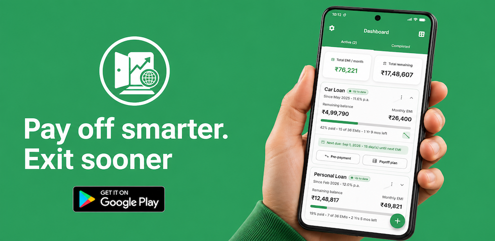

# Loan Exit

Loan Exit is a user-friendly Android Mobile application designed to help individuals plan and manage their loan closures effectively. The app allows users to add multiple loans, calculate EMIs, track payments, and visualize progress toward becoming debt-free.

  

